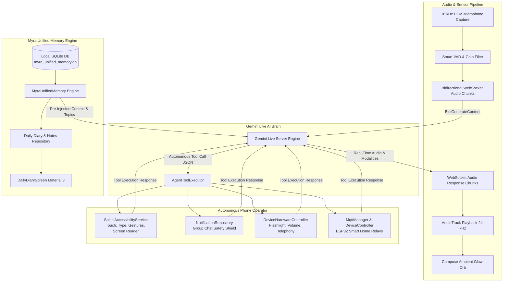

# Myra — Autonomous Human AI Companion & Voice Operating System for Android

<div align="center">


[](https://github.com/)
[](https://ai.google.dev/)
[-3DDC84?style=flat-square&logo=android&logoColor=white)](https://developer.android.com)
[](https://kotlinlang.org/)
[](https://developer.android.com/jetpack/compose)
[](https://sqlite.org/)

**Real-Time Full-Duplex Voice • Permanent Memory Bank & Daily Diary • Autonomous Device Control • Group Safety Shield • ESP32 Smart Home IoT**

</div>

---

## 👨‍💻 Developer & Creator

**Lead Architect & Developer:** **Harshit Raahi**  
*Visionary Software Engineer specializing in Android System Services, Accessibility Automation, Real-time Bidirectional AI, and Local Memory Engines.*

> *"Myra is not just a chatbot or assistant. She is an autonomous, emotionally aware human companion who operates your phone with human-level intelligence, remembers your life across days and months, and protects your communications with deep safety guards."* — **Harshit Raahi**

---

## 🌟 Key Highlights & Architectural Innovations

### 1. 🎙️ Full-Duplex Real-Time Voice (`Gemini Live Engine`)
- **Bidirectional WebSocket Streaming**: Ultra-low latency voice communication via Google's `gemini-2.0-flash-exp` / `gemini-live` real-time protocol.
- **Natural Hindi, Hinglish & English Nuances**: Speaks fluent, respectful Hindi/Hinglish using polite "Aap" with natural fillers (*"Arey waah!"*, *"Achaa..."*, *"Sahi me?"*).
- **Zero-Lag Interruption**: Audio capture (16 kHz PCM Mono) and audio playback (24 kHz PCM Mono) with instant hardware audio flushing upon user interruption.
- **Voice Activity Detection (VAD) & Data Saver**: Smart audio thresholding that prevents network overhead during pauses and silent listening periods.

### 2. 🧠 Unified Permanent Memory & Daily Diary Engine
- **100% Offline SQLite Architecture**: All facts, relationships, habits, preferences, active reminders, and daily notes survive app kills, cache clears, and phone reboots.
- **Past Conversation Recall**: When asked *"Humari purani baat kis pr hui thi?"* or *"Humne pehle kya baat ki thi?"*, Myra references exact topics, dates, and discussion summaries.
- **📖 Daily Memory Diary Screen**:
  - Full Material 3 UI with timeline grouping, mood indicators (🎯 Productive, 😊 Happy, 🧘 Calm, 💡 Idea), search filters, and text-to-speech note narration.
  - **Auto-Synthesized Daily Recaps**: Proactively generates daily reflection summaries from conversation turns and newly learned user facts.
  - **Voice Diary Tools**: Say *"Myra, diary me likho..."* or *"Meri diary sunao"* for hands-free journal logging.

### 3. 🛡️ Group Chat Safety Shield (Smart Notification Guard)
- **Zero Accidental Group Replies**: Built-in intelligence detects whether an incoming message is a **1-on-1 personal chat** or a **Group (College, Faculty, Teachers, Work, Family)**.
- **Strict Protection Guard**: When the user gives ambiguous commands like *"jisse chatting kar raha hun usko reply kar do"* or *"latest ko reply karo"*:
  - **1-on-1 chats** are strictly prioritized.
  - **Group chats are shielded and blocked from auto-replies** unless the user explicitly names the group, completely preventing disastrous accidental replies to college professors or official groups!


### 4. 📱 Autonomous Human Phone Operator
- **Live Screen Perception (`observe_screen`)**: Reads active UI elements, view hierarchies, visible text, and screen contents via `SoltiniAccessibilityService`.
- **System-Wide Action Execution**: Touch injection $(x, y)$, text typing, Enter submission, scrolling, app launching, screen locking/waking, screenshot capture, and status bar control.
- **Hands-Free Telephony & SMS**: In-call voice screening, contact calling, and SMS dispatching.

### 5. 🏠 ESP32 Smart Home IoT Automation
- Native **MQTT relay and device controller** built into the core engine.
- Voice commands like *"Ceiling light on karo"*, *"Fan band karo"*, or *"Kitchen relay toggle karo"* instantly control physical ESP32 relays and smart plugs.

---

## 🏗️ System Architecture Flow



---

## 📦 Directory Structure

```
app/src/main/java/com/soltini/app/
├── MainActivity.kt                # Root activity with Jetpack Compose Navigation & Scaffold
├── agent/
│   ├── AgentToolExecutor.kt       # Autonomous tool execution router & parameter parsing
│   └── SoltiniAccessibilityService.kt # Screen reader, touch injection, gesture engine
├── memory/
│   └── MyraUnifiedMemory.kt       # Persistent SQLite Unified Memory, Recaps & Diary Engine
├── network/
│   └── GeminiLiveManager.kt       # Bidirectional WebSocket Live Streaming & Tool Declarations
├── notifications/
│   ├── NotificationRepository.kt  # Notification listener & Group Chat Safety Shield
│   └── NotificationItem.kt        # Notification data model with isGroup classification
├── services/
│   └── BackgroundVoiceService.kt  # Foreground Service for persistent voice & audio focus
├── settings/
│   └── AppSettings.kt             # Developer passcode (25102005), identity & persona generator
├── ui/
│   ├── DailyDiaryScreen.kt        # Material 3 Memory Diary & Notes UI
│   ├── VoiceScreen.kt             # Main AI Voice screen with glowing orb & quick prompt chips
│   ├── SettingsScreen.kt          # Permissions, configuration & developer settings
│   └── theme/                     # Dark theme, color scheme & typography
```

---

## 🚀 Setup & Installation

### Prerequisites
- Android Studio Ladybug / Meerkat (or newer)
- Android SDK 26 to 36
- Java 17+ & Kotlin 2.0
- Google Gemini API Key

### Configuration
1. Clone the repository:
   ```bash
   git clone https://github.com/your-username/myra-ai.git
   cd myra-ai
   ```
2. Set your Gemini API Key in `gradle.properties` or via the in-app Settings:
   ```properties
   GEMINI_API_KEY=your_gemini_api_key_here
   ```
3. Build and install:
   ```bash
   ./gradlew assembleDebug
   ```

### Permission Setup Guide
To unlock Myra's full autonomous capabilities:
1. **Microphone**: Record audio for real-time voice streaming.
2. **Accessibility Service**: Enables on-screen vision, touch gestures, and app automation.
3. **Notification Access**: Enables reading notifications and sending safe direct replies.
4. **Overlay (Display Over Other Apps)**: Keeps the floating assistant orb accessible anywhere.
5. **Battery Optimization**: Set to **Unrestricted** to prevent the OS from killing the background service.

---

## 🛡️ Security & Privacy Philosophy

1. **No External Cloud Storage for Memories**: Your personal memory bank, diary notes, and conversation recaps never leave your device. They are stored strictly in local SQLite.
2. **Group Chat Safety Guard**: Prevents embarrassing or career-damaging accidental replies to class groups, teacher forums, or professional channels.
3. **Banking Mode Protection**: Automatically detects financial and banking applications (GPay, PhonePe, Paytm, YONO, HDFC, etc.) and pauses accessibility capturing.

---

## 📜 Credits & License

- **Architect & Developer**: **Harshit Raahi**
- **Powered by**: Google Gemini Live API & Android Open Source Project (AOSP)

*Copyright © 2024–2026 Harshit Raahi. All rights reserved.*
